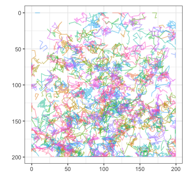

<!-- README.md is generated from README.Rmd. Please edit that file -->

# TrackMateR <a href='https://quantixed.github.io/TrackMateR/'></a>

<!-- badges: start -->

[](https://github.com/quantixed/TrackMateR/actions/workflows/R-CMD-check.yaml)
[](https://zenodo.org/badge/latestdoi/453722113)
<!-- badges: end -->

Analysis of TrackMate XML outputs in R.

[TrackMate](https://imagej.net/plugins/trackmate/) is a single-particle
tracking plugin for ImageJ/Fiji. The standard output from a tracking
session is in TrackMate XML format.

The goal of this R package is to import all of the data associated with
the final filtered tracks in TrackMate for further analysis and
visualization in R.

## Installation

Once you have installed [R](https://cran.rstudio.com) and [RStudio
Desktop](https://www.rstudio.com/products/rstudio/download/), you can
install TrackMateR using devtools

``` r
# install.packages("devtools")
devtools::install_github("quantixed/TrackMateR")
```

## An Example

A basic example is to load one TrackMate XML file, calibrate it (if
needed) and analyse it.

``` r
library(ggplot2)
library(TrackMateR)
# an example file is provided, otherwise use file.choose()
xmlPath <- system.file("extdata", "ExampleTrackMateData.xml", package="TrackMateR")
# read the TrackMate XML file into R using
tmObj <- readTrackMateXML(XMLpath = xmlPath)
#> Units are:  1 pixel and 0.07002736 s 
#> Spatial units are in pixels - consider transforming to real units
#> Collecting spot data. Using 12 cores
#> Matching track data...
#> Calculating distances...
# Pixel size is actually 0.04 um and original data was 1 pixel, xyscalar = 0.04
tmObj <- correctTrackMateData(dataList = tmObj, xyscalar = 0.04, xyunit = "um")
#> Correcting XY scale.
# generate a report
reportDataset(tmObj)
```

<!-- -->

TrackMateR can generate several different types of plot individually
using commands or it can make them all automatically and create a report
for you.

-   For details of how to make individual plots and/or tweak the default
    parameters, see `vignette("TrackMateR")`
-   To see how to compare different datasets, see
    `vignette("comparison")`

## Credits

TrackMateR builds on initial work by Julien Godet on
[trackR](https://github.com/jgodet/trackR). Méghane Sittewelle provided
example TrackMate data and helped with testing TrackMateR.
