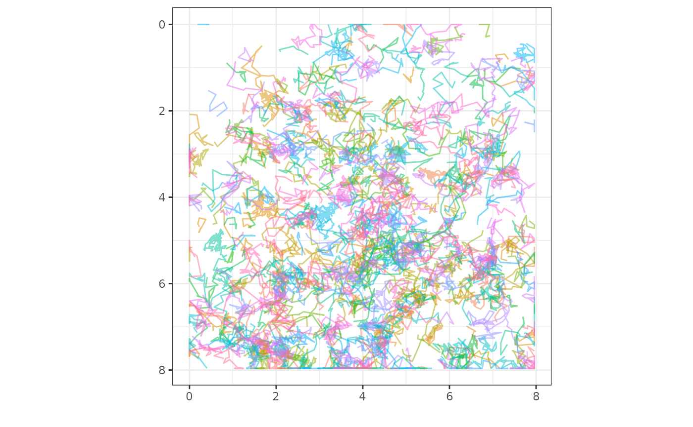
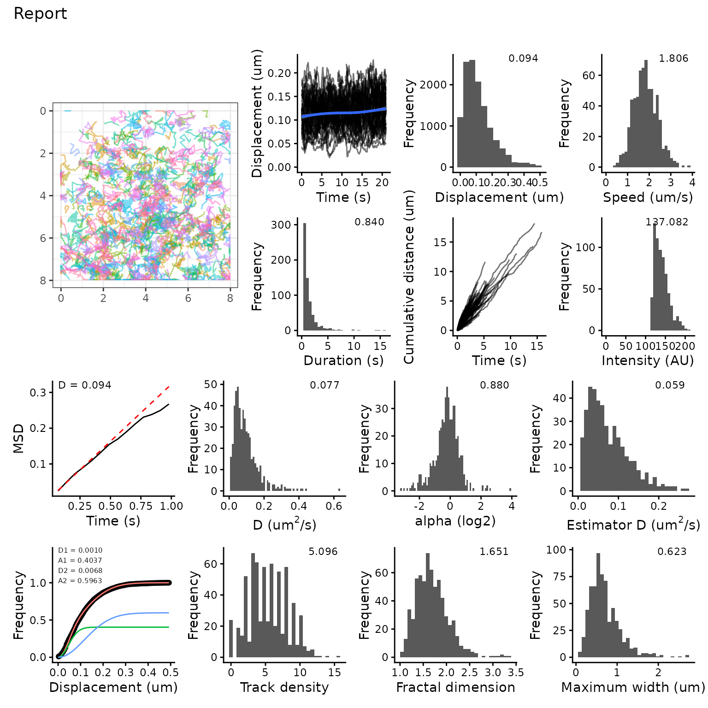
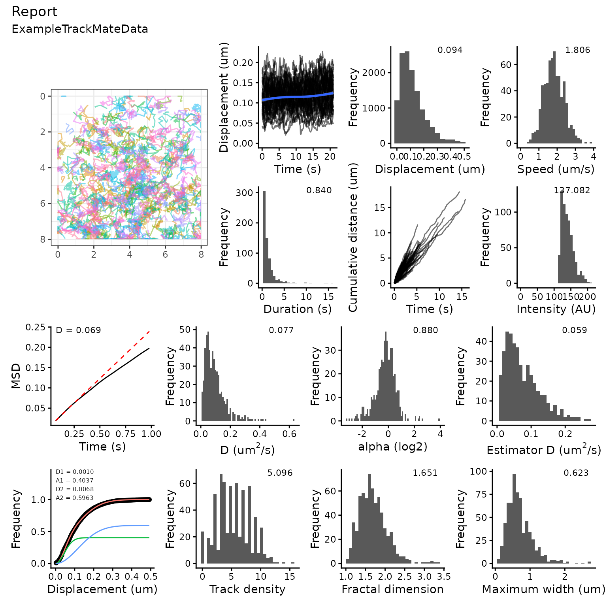

# Getting Started

TrackMateR is an R package to analyse TrackMate XML outputs.

[TrackMate](https://imagej.net/plugins/trackmate/) is a single-particle
tracking plugin for ImageJ/Fiji. The standard output from a tracking
session is in TrackMate XML format.

The goal of this R package is to import all of the data associated with
the final filtered tracks in TrackMate for further analysis and
visualization in R.

## Installation

Once you have installed [R](https://cran.rstudio.com) and [RStudio
Desktop](https://www.rstudio.com/products/rstudio/download/), you can
install TrackMateR using devtools

``` r
# install.packages("devtools")
devtools::install_github("quantixed/TrackMateR")
```

## An Example

A basic example is to load one TrackMate XML file and analyse it. This
would typically be a tracking session associated with a single movie
(referred to here as a single dataset).

``` r
library(ggplot2)
library(TrackMateR)
# an example file is provided, otherwise use file.choose()
xmlPath <- system.file("extdata", "ExampleTrackMateData.xml", package="TrackMateR")
# read the TrackMate XML file into R using
tmObj <- readTrackMateXML(XMLpath = xmlPath)
#> Units are:  1 pixel and 0.07002736 s 
#> Spatial units are in pixels - consider transforming to real units
#> Matching track data...
#> Calculating distances...
```

With the example data, we got a warning telling us that the data is
scaled as pixels. If your TrackMate data is correctly calibrated you can
skip this step but if you need to recalibrate it:

``` r
# Pixel size is 0.04 um and original data was 1 pixel, xyscalar = 0.04
tmObj <- correctTrackMateData(dataList = tmObj, xyscalar = 0.04, xyunit = "um")
#> Correcting XY scale.
```

With this done, we can have a look at the data.

``` r
plot_tm_allTracks(tmObj)
```



So, after reading in the TrackMate file with
[`readTrackMateXML()`](https://quantixed.github.io/TrackMateR/reference/readTrackMateXML.md)
we have an object which we can visualise using
[`plot_tm_allTracks()`](https://quantixed.github.io/TrackMateR/reference/plot_tm_allTracks.md).

TrackMateR can generate several different types of plot individually
using commands like
[`plot_tm_allTracks()`](https://quantixed.github.io/TrackMateR/reference/plot_tm_allTracks.md)
or it can make them all automatically and create a report for you.

``` r
reportDataset(tmObj)
```



In the next section you will see how to do more advanced analysis, and
pick and choose what outputs you will make. However, it is possible to
change the defaults of `reportDatasets()` to tune things a bit more
while still making a nice report. For example,
`reportDatasets(tmObj, radius = 100)` will use the defaults for
everything except the radius for searching for neighbours in the track
density analysis. Parameters that can be changed are:

- N, short - from MSD analysis
- deltaT, mode, nPop, init, timeRes, breaks - from jump distance
  calculation and fitting
- radius - from track density analysis

## A more advanced example

Perhaps the default options do not suit your needs. With just a few more
lines of code, you can tweak the report to do the analysis you want.

Below you will see that the dataset we read in was not scaled correctly.
After reading in, we rescale it and then we start to generate the
report.

The report shows analysis of mean squared displacement, jump distance
and track density, among other plots. These three things must be
calculated first using
[`calculateMSD()`](https://quantixed.github.io/TrackMateR/reference/calculateMSD.md),
[`calculateJD()`](https://quantixed.github.io/TrackMateR/reference/calculateJD.md)
and `calculateTrackDensity`. This allows you to have some control over
the analysis, for example setting the search radius for Track Density.
Finally, these items can be fed into
[`makeSummaryReport()`](https://quantixed.github.io/TrackMateR/reference/makeSummaryReport.md)
as shown below, and the report is created.

``` r
# we can get a data frame of the correct TrackMate data 
tmDF <- tmObj[[1]]
# and a data frame of calibration information
calibrationDF <- tmObj[[2]]
# we can calculate mean squared displacement
msdObj <- calculateMSD(df = tmDF, method = "ensemble", N = 3, short = 8)
# and jump distance
jdObj <- calculateJD(dataList = tmObj, deltaT = 1)
# and look at the density of tracks
tdDF <- calculateTrackDensity(dataList = tmObj, radius = 1.5)
# and calculate fractal dimension
fdDF <- calculateFD(dataList = tmObj)
# if we extract the name of the file
fileName <- tools::file_path_sans_ext(basename(xmlPath))
# we can send all these things to makeSummaryReport() to get a nice report of our dataset
makeSummaryReport(tmList = tmObj, msdList = msdObj, jumpList = jdObj, tddf = tdDF, fddf = fdDF,
titleStr = "Report", subStr = fileName, auto = FALSE)
```



Note that `makeSummaryReport` can take additional arguments to give the
user some control over fitting to jump distance. For example, `nPop = 1`
will fit one population instead of two (the dafault), and
`init = list()` can be a list of guesses for the initial fit.

This vignette described the analysis of a single dataset. For analysis
of more than one dataset, see
[`vignette("comparison")`](https://quantixed.github.io/TrackMateR/articles/comparison.md)
